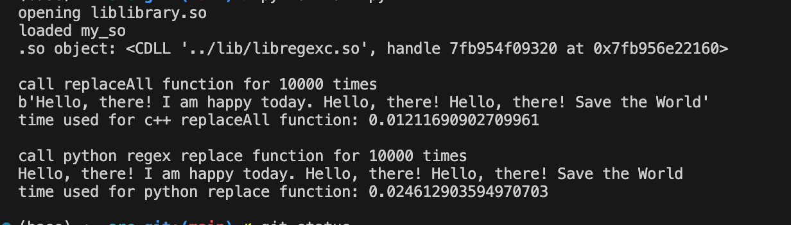

# REGEX_C

### compile regex functions for python main.py use
```
export DYLD_LIBRARY_PATH="/Users/user/dev/Github/Github_repo/regex_c/lib:$DYLD_LIBRARY_PATH"
clang -std=c++17 -c -o regex_c.o regex_c.cpp 
clang -shared -undefined dynamic_lookup -o /Users/user/dev/Github/Github_repo/regex_c/lib/libregexc.so regex_c.o
clang++ -L/Users/user/dev/Github/Github_repo/regex_c/lib/ -Wall -o code main.cpp -lregexc
```

### direct compile the src codes in src directory
```
clang++ -o binary main.cpp regex_c.cpp 
```

### compile using CMakeLists.txt
```
cd build
cmake ..
make
./binary
```

### comparison result
